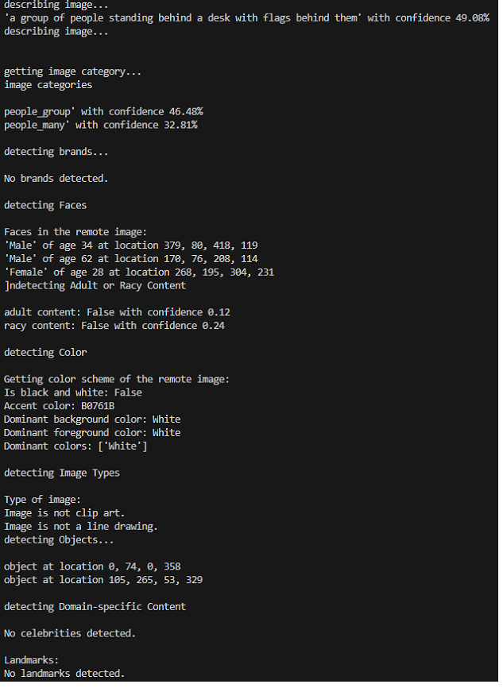

# AI-vision
AI vision - image, video and their relevant contents.

# Screenshot

### Detecting objects in image

### Describing image

# Description

The application provides AI features for image, video, and their relevant contents.

- face recognition
- object detection
- abnormal activity
- attributes in image and video
- and more

# Tools 

AI, Azure Cognitive, Cloud, Python, C#...

# Installing

install vs code (if necessary)
Azure cognitive sdk

# Authors

@Ideaslink

# Acknowledgement

Azure cognitive, Azure AI

# Version history
version 2.0.0.2

# License
MIT

